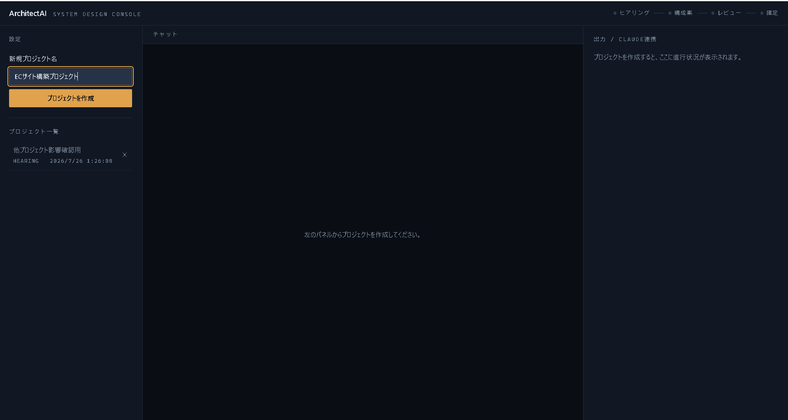
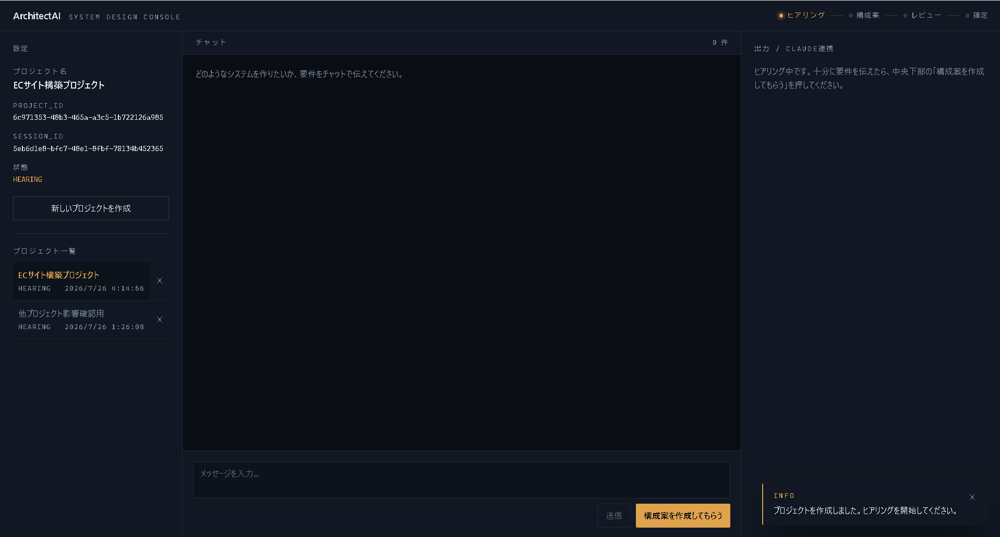
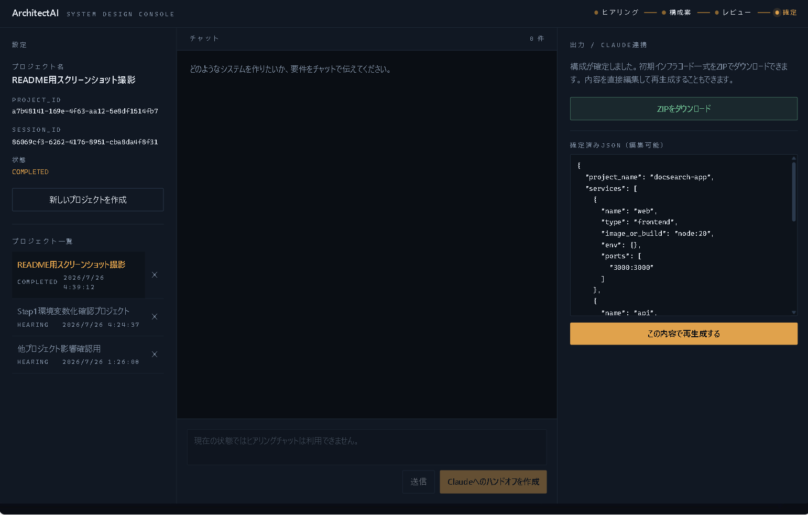

# ArchitectAI

漠然としたシステムのアイデアを、AIとの対話だけで「要件定義 → 構成案 →
レビュー → 初期インフラコード」まで一気通貫で形にするための、
個人開発のシステム設計アシスタントです。

ローカルLLM（Ollama）による無料のヒアリング・構成案作成と、
Claude Webによる最終レビュー（Human-in-the-Loop）を組み合わせることで、
API課金ゼロかつ人間の最終判断を必ず介在させる設計にしています。

---

## プロジェクトの目的

新規システムの立ち上げ時、「何を作りたいかは何となくあるが、要件として
言語化し、技術構成に落とし込む」作業には時間がかかります。ArchitectAIは
このプロセスを、

1. AIとの対話で要件を掘り下げる（ヒアリング）
2. 対話内容から構成案をAIに作成させる
3. 人間（Claude Web）が構成案をレビューし、最終JSONとして確定する
4. 確定したJSONから、初期インフラコード一式（`docker-compose.yml`等）を
   自動生成する

という4段階に分解し、各段階を専用の状態機械（`HEARING` →
`PROPOSED` → `CLAUDE_REVIEW` → `COMPLETED`）として管理することで、
「思いつきレベルのアイデア」から「動かせる初期構成」までの距離を
縮めることを目的としています。

---

## 画面一覧

### 初期画面



プロジェクト名を入力するだけで、ヒアリング用のセッションが自動生成
されます。左パネルには過去に作成したプロジェクトの一覧が表示され、
`session_id`をlocalStorageに永続化しているため、画面をリロードしても
作業中の状態（ヒアリング途中・レビュー中・確定済みのいずれでも）が
失われません。

### ヒアリング中



ヘッダー右上のパイプライン表示（ヒアリング → 構成案 → レビュー →
確定）で、現在このプロジェクトがどの段階にあるかが常に分かるように
しています。プロジェクト一覧からは、いつでも別プロジェクトへ
ワンクリックで切り替えられます。

### 確定済み（JSON編集・エクスポート）



Claude Webでのレビューを経て確定した構成JSONは、画面上でそのまま
再編集できます。編集後は既存のバリデーション・サニタイズ処理を
再度通した上で新しいバージョンとして保存され、いつでも最新の内容で
ZIPをダウンロードできます。

---

## システムの流れ

```
[HEARING]                [PROPOSED]              [CLAUDE_REVIEW]           [COMPLETED]
ユーザーが要件を   --->  ローカルLLMが構成案 --->  Claude Webへ手動   --->  確定JSONから
チャットで伝える          を作成（Ollama）          貼り付けでレビュー       IaC一式をZIP生成
                                                    ・確定JSONを提出
```

1. **ヒアリング（`HEARING`）**：ユーザーがチャットで要件を伝えると、
   ローカルのOllama（`gemma4:e4b-it-q4_K_M`）がPMとして深掘りの質問を
   返します。API課金は発生しません。
2. **構成案作成（→`PROPOSED`）**：「構成案を作成してもらう」を押すと、
   それまでの会話内容をもとにOllamaが構成案を作成します。
3. **Claudeへのハンドオフ（→`CLAUDE_REVIEW`）**：構成案からレビュー用
   プロンプトを自動生成し、クリップボードにコピー。ユーザーがClaude
   Webへ手動で貼り付けてレビューを依頼します（**意図的な
   Human-in-the-Loop**。詳細は下記「技術的な工夫」参照）。
4. **確定（→`COMPLETED`）**：Claude Webの出力（JSON）を画面に貼り付けて
   送信すると、フェンス除去・JSONパース・スキーマバリデーションを経て
   構成が確定します。以降、画面上でJSONを直接編集して再生成することも
   できます。
5. **IaC生成**：確定済みJSONをJinja2テンプレートに流し込み、
   `docker-compose.yml`と`NOTES.md`を含むZIPをメモリ上で生成します。

---

## 技術構成

| レイヤー | 技術 |
|---|---|
| フロントエンド | Next.js 15 (App Router) / React 19 / TypeScript / Tailwind CSS |
| バックエンド | FastAPI / SQLAlchemy 2.0 (同期) / Pydantic v2 |
| データベース | PostgreSQL 16 (Docker) |
| ヒアリング・構成案AI | ローカルLLM: Ollama (`gemma4:e4b-it-q4_K_M`) |
| 最終レビューAI | Claude Web（Human-in-the-Loop、貼り付け方式） |
| IaC生成 | Jinja2テンプレート → メモリ上でZIP化 |
| インフラ | Docker Compose（`db` / `backend` / `frontend`の3コンテナ） |

役割ベースで整理すると、**日常的なヒアリング・構成案作成はローカルAIに
任せてコストゼロで回し、最終的な品質チェックだけを人間＋Claudeに
委ねる**という構成です。

---

## 技術的な工夫

- **Human-in-the-Loopを意図的に維持する設計**：AIが生成した構成案を
  そのままシステムに反映せず、必ずClaude Webでの人間によるレビューを
  経由させています。一方で、レビュー後の確定JSONは画面上で直接編集・
  再生成できるようにしており（`PUT /edit_claude_json`）、
  「レビューの厳格さ」と「確定後の修正しやすさ」を両立させています。
  この編集機能はレビューをバイパスする設計判断であることを明記した
  上で、既存のバリデーション・サニタイズ処理は必ず通す実装にしています。
- **YAMLインジェクション対策**：Claude Webの出力やユーザーによる直接
  編集からサービス名（`services[].name`）を受け取る際、英数字・
  ハイフン・アンダースコアのみを許可する正規表現バリデーションを
  Pydanticの`field_validator`で強制しています。生成される
  `docker-compose.yml`にコロンや改行を含む値がそのまま埋め込まれ、
  意図しないYAML構造の破壊やキーの追加が起きることを防いでいます。
- **確定JSONの編集履歴を保持**：確定・再編集のたびに新しい
  `role=system`メッセージとして`messages`テーブルに追記し、古い履歴を
  削除しません。`/export`は常に最新のメッセージを参照するため、
  過去の確定内容を失うことなく「常に最新の構成をエクスポートできる」
  状態を両立しています。
- **状態遷移の一元管理**：`HEARING`→`PROPOSED`→`CLAUDE_REVIEW`→
  `COMPLETED`という許可された遷移のみをコード上の1箇所
  （`ALLOWED_STATE_TRANSITIONS`）に列挙し、それ以外の遷移は
  サービス層で拒否します。UI側のパイプライン表示もこの状態を
  唯一の情報源としています。
- **セッション状態のlocalStorage永続化**：`project_id`/`session_id`を
  localStorageに保存し、画面リロード時にはプロジェクト一覧と突き合わせて
  復元します（既存プロジェクトの一覧取得APIを使い、404相当のケースは
  一覧に見つからないことで判定）。ヒアリング途中・レビュー中・確定済み
  いずれの状態でも作業内容を失いません。
- **環境変数化によるセキュリティ対応**：当初`docker-compose.yml`に
  平文で記載していたPostgreSQLの認証情報を`.env`ファイルへ分離し、
  `${POSTGRES_USER}`等の変数参照に置き換えました。`.env`は
  `.gitignore`で除外し、代わりに値をプレースホルダー化した
  `.env.example`をリポジトリに含めています。

---

## 設計判断

### なぜHuman-in-the-Loop（Claude Webでの人間レビュー必須）を維持したか

ローカルLLM（Ollama）が生成する構成案は、API課金ゼロで高速に得られる
反面、ハルシネーションや文脈の見落としのリスクを完全には排除できません。
インフラ構成のような「間違えると実運用に直結するアウトプット」を
無条件に信頼するのは危険と判断し、`CLAUDE_REVIEW`状態を必須の中間
ステップとして設計に組み込みました。これにより、日常的な思考の壁打ちは
コストゼロのローカルAIに任せつつ、最終的な品質保証だけは人間（＋より
高性能なClaude）の判断を必ず介在させる、という役割分担を実現しています。

### なぜ確定後のJSON編集機能でレビューをバイパスできるようにしたか、そのトレードオフ

確定後の構成JSONを画面上で直接編集できる`PUT /edit_claude_json`は、
意図的にHuman-in-the-Loopをバイパスする設計です。レビュー後に
「ポート番号を1つ直したいだけ」といった軽微な修正のたびに、Claude Webへの
再ハンドオフを強制するのは実用上のコストが大きすぎると判断したため
導入しました。トレードオフとして、この経路で入力された内容はClaude Webの
目を経由しません。そのため、既存のバリデーション・サニタイズ処理
（フェンス除去・スキーマ検証・`services[].name`の文字種制限等）は
編集経路でも必ず再適用し、構造的な安全性だけは経路によらず一律に
担保しています。「レビューの厳格さ」と「確定後の修正しやすさ」は
完全には両立せず、後者を選んだ場合に生じるレビュー漏れのリスクは
利用者（＝開発者自身）が許容する、という前提の設計判断です。

### なぜ認証機能をこのタイミングで、この設計（JWT・ユーザー毎のプロジェクト分離）で追加したか

当初ArchitectAIはローカルPCでのみ動く前提のツールで、外部非公開の
ポート（4500）で運用することを理由に認証は不要と判断していました。
しかし、ArchitectAIを外部公開する方針に転換したことで、
「ローカルからのアクセス＝信頼できる本人」という前提が成り立たなく
なりました。特に、リバースプロキシ経由の外部アクセスはバックエンドから
見るとローカルからのアクセスと区別がつかないため、この前提のまま公開
すると誰でも管理者権限を得られる重大な脆弱性になります。この方針転換を
機に、パスワードのbcryptハッシュ化・JWTによるステートレスな認証・
`projects.user_id`によるユーザー単位のデータ分離を導入しました
（実装の詳細・passlibを採用しなかった理由等はグループAの作業記録を
参照）。「管理者のローカル自動ログイン」のような簡易な仕組みは、
この前提の下では成立しないため採用していません。

### なぜalembicを導入したか

導入前は`Base.metadata.create_all()`でテーブルを用意する、開発初期の
リーンな構成のままでした。この方式は新規テーブルの作成はできますが、
既存テーブルへの列追加（`ALTER TABLE`）はできません。認証機能の追加に
伴い、既存の`projects`テーブルに`user_id`列を追加する必要が生じ、
この制約が現実の障害になりました。導入作業の過程では、
`create_all()`を残したままalembicのマイグレーションを実行したところ、
`create_all()`が先にテーブルを作成してしまい、マイグレーション自体は
「差分なし」と誤判定して何も実行しない、という不具合に実際に
遭遇しました（テーブル定義の変更経路が2つ並存すると、どちらが実際に
適用したのか追跡できなくなる典型例です）。この経験から、スキーマの
生成・変更経路をalembicのマイグレーションに一本化し、`create_all()`は
撤去しました。今後予定している「過去プロジェクトの曖昧検索」機能
（埋め込みベクトル用の新規カラムまたはテーブルが必要）でも、同様の
スキーマ変更を安全に行うための基盤として活用する想定です。

### 非機能要件

- **可用性**：ヒアリング・構成案作成は、ホストマシン上のOllamaに
  単一障害点として依存しています。Ollamaが未起動、またはモデル未取得の
  場合、`chat`エンドポイントは`OllamaConnectionError` /
  `OllamaModelNotFoundError`で明示的に失敗し、無言のハングにはなりません
  （「トラブルシューティング」参照）。冗長化やフォールバック先の用意は
  現時点では行っていません。
- **セキュリティ**：認証機能導入後も、パスワードリセット・メール
  アドレス確認機能は未実装です（設計時点でスコープ外と明記した上での
  判断です）。パスワードを忘れた場合、現状はアカウントを作り直す以外の
  手段がありません。また、新規登録は現状誰でも行える設計です。外部公開を
  継続する場合、招待制・レート制限・パスワードリセット機能の追加を
  今後の課題として認識しています。

---

## セットアップ手順

### 前提条件

- Docker Desktop（Windows / Mac）がインストール・起動済みであること
- Ollamaがホストマシン上で起動しており、`gemma4:e4b-it-q4_K_M`モデルが
  取得済みであること

```powershell
ollama pull gemma4:e4b-it-q4_K_M
ollama serve
```

### 環境変数の設定

`.env.example`をコピーして`.env`を作成し、必要に応じて値を変更して
ください（ローカル検証用途であれば、そのままでも動作します）。

```powershell
cd architect-ai
copy .env.example .env
```

`.env`には以下の3項目を設定します。

```
POSTGRES_USER=architect
POSTGRES_PASSWORD=architect
POSTGRES_DB=architectai
```

### 起動手順

```powershell
docker compose up --build
```

- Frontend: http://localhost:4500
- Backend API: http://localhost:8000/docs

### 停止

```powershell
docker compose down
```

## トラブルシューティング

| 症状 | 原因 | 対処 |
|---|---|---|
| チャットが応答なしでハングする | Ollamaが起動していない / モデル未取得 | `ollama list`でモデル存在を確認。バックエンドは接続失敗時に明示的なエラーメッセージを返す設計です |
| backendがdbに接続できない | dbの起動待ちが不足 / `.env`の値が不一致 | `depends_on.condition: service_healthy`済みだが、初回起動時は数分かかる場合あり。`.env`の値を変更した場合、既存のDBボリュームとの認証不整合に注意してください |

---

## 今後の拡張

- 1プロジェクトにつき複数セッションを保持できるようにし、同じ
  プロジェクトで要件定義をやり直せるようにする
- IaC生成テンプレートの対象をDocker Compose以外（Terraform等）にも
  拡張する
- Claude Webとの手動貼り付けに代えて、Claude APIとの直接連携を
  選択できるオプションを追加する（API課金と引き換えに、完全自動化を
  選べるようにする）
